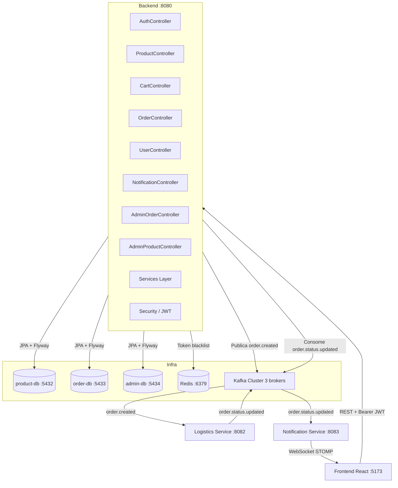
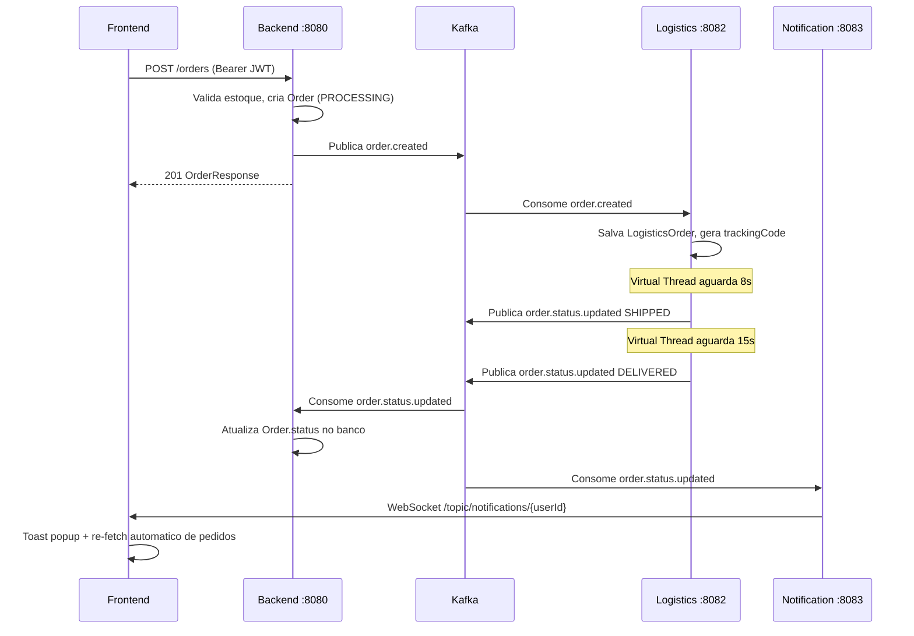
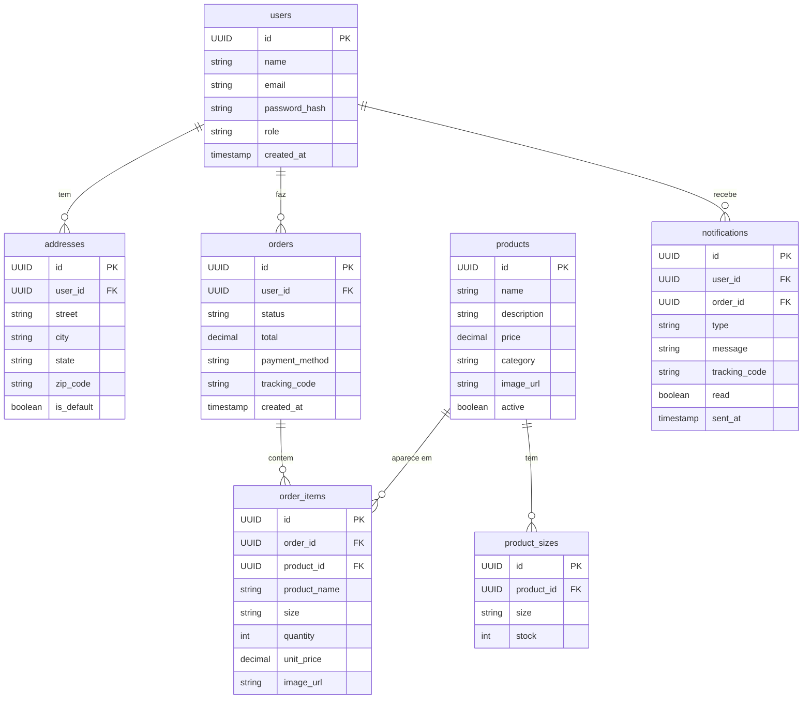

# TeeStore — Backend Service

Serviço principal da plataforma TeeStore. Responsável por autenticação, catálogo de produtos, carrinho, pedidos, notificações e painel administrativo. Expõe uma API REST consumida pelo frontend React e publica eventos no Apache Kafka para os demais microserviços.

---

## Sumário

- [Arquitetura](#arquitetura)
- [Tecnologias](#tecnologias)
- [Padrões de Projeto](#padrões-de-projeto)
- [Estrutura de Pacotes](#estrutura-de-pacotes)
- [Banco de Dados](#banco-de-dados)
- [Variáveis de Ambiente](#variáveis-de-ambiente)
- [Como Rodar](#como-rodar)
- [API — Referência de Rotas](#api--referência-de-rotas)
- [Kafka — Tópicos](#kafka--tópicos)
- [Testes](#testes)

---

## Arquitetura



### Fluxo de um Pedido



---

## Tecnologias

| Camada | Tecnologia |
|---|---|
| Linguagem | Java 21 |
| Framework | Spring Boot 3.x |
| Seguranca | Spring Security + JWT (JJWT) |
| ORM | Spring Data JPA + Hibernate |
| Banco | PostgreSQL 16 |
| Migrations | Flyway |
| Cache / Blacklist | Redis 7 |
| Mensageria | Apache Kafka 3.5 (cluster 3 brokers) |
| Docs | SpringDoc OpenAPI 3 / Swagger UI |
| Build | Maven |
| Threads | Virtual Threads (Java 21) |
| Testes | JUnit 5 + Mockito |

---

## Padrões de Projeto

**Injeção de Dependência (Dependency Injection)**
Todas as dependências são injetadas via construtor, sem `@Autowired` em campos. Isso torna as dependências explícitas e facilita testes unitários (sem necessidade de reflection ou Spring context nos testes).

```java
// OrderService.java
public OrderService(OrderRepository repo, OrderEventProducer producer) {
    this.repo = repo;
    this.producer = producer;
}
```

**Strategy**
A construção de mensagens de notificação aplica o padrão Strategy via `switch expression`, permitindo trocar o comportamento por status sem modificar o código chamador:

```java
private String buildMessage(String status, String orderId) {
    return switch (status) {
        case "SHIPPED"   -> "Seu pedido #" + shortId + " foi enviado!";
        case "DELIVERED" -> "Seu pedido #" + shortId + " foi entregue!";
        default          -> "Status atualizado para " + status;
    };
}
```

**Repository Pattern**
Toda persistencia ocorre via interfaces que estendem `JpaRepository`, isolando completamente a camada de dados das regras de negocio.

**DTO Pattern**
Request e Response usam `record` Java imutaveis, separando o contrato publico da API das entidades JPA internas.

**Token Blacklist (Redis)**
O `AuthService` persiste tokens invalidados no Redis com TTL igual a expiracao do token — implementando logout stateless sem session server-side.

**Idempotencia**
O `StatusEventConsumer` verifica existencia antes de processar um evento, protegendo contra reentrega do Kafka.

---

## Estrutura de Pacotes

```
com.projeto.integrador.backend
├── config/            # CorsConfig, KafkaTopicConfig, OpenApiConfig,
│                      # RedisConfig, SecurityConfig, WebConfig
├── controller/        # AuthController, ProductController, CartController,
│                      # OrderController, UserController, NotificationController,
│                      # AdminOrderController, AdminProductController
├── domain/
│   ├── entity/        # User, Product, ProductSize, Order, OrderItem,
│   │                  # Notification, Address
│   └── enums/         # Role, OrderStatus, NotificationType, Size
├── dto/               # Records de Request/Response organizados por dominio
│   ├── auth/
│   ├── cart/
│   ├── order/
│   ├── product/
│   ├── user/
│   ├── notification/
│   └── dashboard/
├── exception/         # GlobalExceptionHandler, BusinessException,
│                      # ResourceNotFoundException, UnauthorizedException
├── messaging/         # OrderEventProducer, StatusEventConsumer, Events
├── repository/        # Interfaces JPA
├── security/          # JwtTokenProvider, JwtAuthenticationFilter,
│                      # UserDetailsServiceImpl
└── service/           # AuthService, ProductService, CartService,
                       # OrderService, UserService, NotificationQueryService,
                       # OrderAdminService, DashboardService, FileUploadService
```

---

## Banco de Dados

O backend utiliza **3 bancos PostgreSQL separados** (product-db, order-db, admin-db), gerenciados via Flyway com versionamento incremental.



**Migrations Flyway (V1–V21):**

| Versao | Descricao |
|---|---|
| V1 | Tabela `users` |
| V2 | Tabela `addresses` |
| V3 | Tabela `products` |
| V4 | Tabela `product_sizes` |
| V5 | Tabela `orders` |
| V6 | Tabela `order_items` |
| V7 | Tabela `notifications` |
| V8–V12 | Correcoes de colunas ENUM para VARCHAR |
| V13–V21 | Seeds de usuarios, produtos e pedidos de demonstracao |

---

## Variáveis de Ambiente

Copie `.env.example` para `.env`:

```env
SERVER_PORT=8080

# Banco de dados
DB_HOST=localhost
DB_PORT=5432
DB_NAME=productdb
DB_USER=postgres
DB_PASSWORD=postgres

# JWT
JWT_SECRET=seu_secret_256_bits_aqui
JWT_EXPIRATION=86400000

# Redis
REDIS_HOST=localhost
REDIS_PORT=6379

# Kafka
KAFKA_BOOTSTRAP_SERVERS=localhost:29092,localhost:29093,localhost:29094

# CORS
CORS_ALLOWED_ORIGINS=http://localhost:5173

# Upload de imagens
BASE_URL=http://localhost:8080
UPLOAD_DIR=uploads
```

---

## Como Rodar

**Pré-requisitos:** Java 21+, Maven 3.9+, infraestrutura rodando (ver `Projeto-Integrador-Infra`)

```bash
# 1. Suba a infraestrutura (Kafka + PostgreSQL + Redis)
cd Projeto-Integrador-Infra
docker compose up -d

# 2. Configure as variáveis
cd Projeto-Integrador-Backend
cp .env.example .env

# 3. Execute
mvn spring-boot:run
```

O servico sobe em `http://localhost:8080`.

**Swagger UI:** `http://localhost:8080/swagger-ui.html`

---

## API — Referência de Rotas

### Autenticação — `/auth`

| Metodo | Rota | Auth | Descricao |
|---|---|---|---|
| `POST` | `/auth/register` | — | Cria usuario, retorna `accessToken` + `refreshToken` |
| `POST` | `/auth/login` | — | Login com email/senha |
| `POST` | `/auth/refresh` | — | Renova `accessToken` (refreshToken e rotacionado) |
| `POST` | `/auth/logout` | Bearer | Invalida tokens no Redis |

**Body `/auth/register` e `/auth/login`:**
```json
{ "name": "Victor Hugo", "email": "victor@email.com", "password": "senha123" }
```

**Response (tokens):**
```json
{
  "accessToken": "eyJ...",
  "refreshToken": "eyJ...",
  "userId": "uuid",
  "name": "Victor Hugo",
  "email": "victor@email.com",
  "role": "USER"
}
```

---

### Produtos — `/products`

| Metodo | Rota | Auth | Descricao |
|---|---|---|---|
| `GET` | `/products` | — | Lista produtos ativos (paginado, `page`, `size`, `sort`) |
| `GET` | `/products?search=camiseta` | — | Busca por nome, descricao ou categoria |
| `GET` | `/products/{id}` | — | Busca produto por ID |

**Response `GET /products`:**
```json
{
  "content": [{ "id": "uuid", "name": "Camiseta Basica", "price": 89.90, "sizes": [...] }],
  "page": 0,
  "size": 12,
  "totalElements": 30,
  "totalPages": 3
}
```

---

### Carrinho — `/cart` *(requer JWT)*

| Metodo | Rota | Descricao |
|---|---|---|
| `GET` | `/cart` | Retorna carrinho do usuario autenticado |
| `POST` | `/cart/items` | Adiciona item `{ productId, size, quantity }` |
| `PUT` | `/cart/items/{productId}` | Atualiza quantidade `{ size, quantity }` |
| `DELETE` | `/cart/items/{productId}?size=M` | Remove item |
| `DELETE` | `/cart` | Esvazia o carrinho |

---

### Pedidos — `/orders` *(requer JWT)*

| Metodo | Rota | Descricao |
|---|---|---|
| `POST` | `/orders` | Cria pedido e publica `order.created` no Kafka |
| `GET` | `/orders/my` | Lista pedidos do usuario autenticado |
| `GET` | `/orders/my/{id}` | Busca pedido especifico |

**Body `POST /orders`:**
```json
{
  "items": [{ "productId": "uuid", "size": "M", "quantity": 1 }],
  "paymentMethod": "CREDIT_CARD"
}
```

---

### Usuario — `/users/me` *(requer JWT)*

| Metodo | Rota | Descricao |
|---|---|---|
| `GET` | `/users/me` | Retorna dados do perfil |
| `PUT` | `/users/me` | Atualiza nome e email |
| `PUT` | `/users/me/password` | Altera senha |
| `GET` | `/users/me/addresses` | Lista enderecos |
| `POST` | `/users/me/addresses` | Adiciona endereco |
| `PUT` | `/users/me/addresses/{id}` | Atualiza endereco |
| `DELETE` | `/users/me/addresses/{id}` | Remove endereco |
| `PATCH` | `/users/me/addresses/{id}/default` | Define endereco padrao |

---

### Notificacoes — `/notifications` *(requer JWT)*

| Metodo | Rota | Descricao |
|---|---|---|
| `GET` | `/notifications` | Lista notificacoes do usuario |
| `PATCH` | `/notifications/{id}/read` | Marca como lida |
| `PATCH` | `/notifications/read-all` | Marca todas como lidas |

---

### Admin — Pedidos — `/admin/orders` *(requer ADMIN)*

| Metodo | Rota | Descricao |
|---|---|---|
| `GET` | `/admin/orders` | Lista todos os pedidos (paginado, filtro `?status=`) |
| `GET` | `/admin/orders/{id}` | Busca pedido por ID |
| `PATCH` | `/admin/orders/{id}/status` | Atualiza status manualmente |
| `GET` | `/admin/dashboard` | Metricas: receita, pedidos, usuarios, produtos |

---

### Admin — Produtos — `/admin/products` *(requer ADMIN)*

| Metodo | Rota | Descricao |
|---|---|---|
| `GET` | `/admin/products` | Lista todos os produtos (ativos e inativos) |
| `POST` | `/admin/products` | Cria produto |
| `PUT` | `/admin/products/{id}` | Atualiza produto |
| `POST` | `/admin/products/{id}/image` | Upload de imagem (`multipart/form-data`, campo `file`, max 5 MB) |
| `DELETE` | `/admin/products/{id}` | Desativa produto (soft delete) |

---

## Kafka — Tópicos

| Topico | Direcao | Payload | Consumidor |
|---|---|---|---|
| `order.created` | **Produtor** | orderId, userId, items, total | Logistics Service |
| `order.status.updated` | **Consumidor** | orderId, userId, newStatus, trackingCode | Backend (atualiza status no banco) |
| `notification.send` | **Consumidor** | userId, type, message | Notification Service |

Configuracao do cluster: 3 brokers, RF=3, min ISR=2, 3 particoes por topico. Producer com `acks=all` e idempotencia habilitada.

---

## Testes e Cobertura de Código

### Executar localmente

```bash
# Roda os testes e gera os relatórios de cobertura + execucao
mvn verify
```

Apos a execucao, dois relatorios sao gerados automaticamente:

| Relatorio | Localizacao | Conteudo |
|---|---|---|
| **JaCoCo (cobertura)** | `target/site/jacoco/index.html` | Cobertura linha a linha por classe e metodo |
| **Surefire (execucao)** | `target/site/surefire-report.html` | Testes passados, falhos e ignorados |

Abra os arquivos HTML diretamente no navegador:
```bash
# Windows
start target/site/jacoco/index.html

# macOS
open target/site/jacoco/index.html

# Linux
xdg-open target/site/jacoco/index.html
```

### CI/CD — GitHub Actions

A cada push nas branches `main`, `dev` ou `master`, o workflow `.github/workflows/ci.yml`:

1. Executa todos os testes (`mvn verify`)
2. Publica o resultado inline na aba **Actions** do GitHub (via dorny/test-reporter)
3. Disponibiliza os relatórios como **artefatos para download** (retidos por 30 dias)

Para acessar os relatorios no GitHub:
```
Repositório → Actions → (selecione o workflow) → Artifacts
├── jacoco-coverage-report   ← descompacte e abra index.html
└── surefire-test-report     ← abra surefire-report.html
```

### Classes testadas (JUnit 5 + Mockito)

| Classe de Teste | Casos de Teste |
|---|---|
| `AuthServiceTest` | Registro, login, refresh token, logout, blacklist Redis |
| `ProductServiceTest` | Listagem paginada, busca por texto, criacao, atualizacao, desativacao |
| `CartServiceTest` | Adicionar item, atualizar quantidade, remover, esvaziar carrinho |
| `UserServiceTest` | Perfil, alterar dados, alterar senha, enderecos CRUD |
| `OrderServiceTest` | Criacao de pedido, validacao de estoque, publicacao Kafka |
| `OrderAdminServiceTest` | Listagem paginada por status, atualizacao de status |
| `NotificationQueryServiceTest` | Listagem, marcar como lida, marcar todas como lidas |
| `DashboardServiceTest` | Metricas agregadas de receita, pedidos, usuarios, produtos |
| `FileUploadServiceTest` | Validacao de tipo MIME, validacao de tamanho maximo |

---

## Acesso Admin Padrao (seed)

```
Email:  admin@teestore.com
Senha:  admin123
```

---

*Projeto Integrador — Desenvolvido por Victor Hugo, Josue Felix e Guilherme Bastos*
